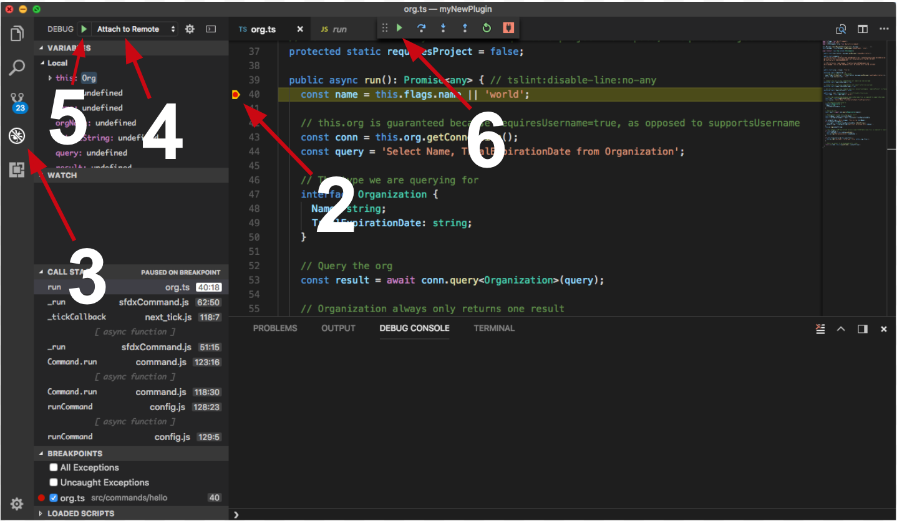

# plugin-limits

A command to display the api limits of your org

## Getting Started

To build the plugin locally, make sure to have yarn installed and run the following commands:

```
Clone the repository
  $ git clone git@github.com:salesforcecli/plugin-user
Install the dependencies and compile
  $ yarn install
  $ yarn prepack
Link your plugin to the sfdx cli
  $ sfdx plugins:link .
To verify
  $ sfdx plugins
```

## Debugging your plugin

We recommend using the Visual Studio Code (VS Code) IDE for your plugin development. Included in the `.vscode` directory of this plugin is a `launch.json` config file, which allows you to attach a debugger to the node process when running your commands.

To debug the `limits:api:display` command:

If you linked your plugin to the sfdx cli, call your command with the `dev-suspend` switch:

```sh-session
$ sfdx limits:api:display -u myOrg@example.com --dev-suspend
```

Alternatively, to call your command using the `bin/run` script, set the `NODE_OPTIONS` environment variable to `--inspect-brk` when starting the debugger:

```sh-session
$ NODE_OPTIONS=--inspect-brk bin/run limits:api:display -u myOrg@example.com
```

2. Set some breakpoints in your command code
3. Click on the Debug icon in the Activity Bar on the side of VS Code to open up the Debug view.
4. In the upper left hand corner of VS Code, verify that the "Attach to Remote" launch configuration has been chosen.
5. Hit the green play button to the left of the "Attach to Remote" launch configuration window. The debugger should now be suspended on the first line of the program.
6. Hit the green play button at the top middle of VS Code (this play button will be to the right of the play button that you clicked in step #5).
   
   Congrats, you are debugging!

## Commands

- sfdx limits:api:display [-u <string>] [--apiversion <string>] [--json] [--loglevel trace|debug|info|warn|error|fatal|TRACE|DEBUG|INFO|WARN|ERROR|FATAL]

## `sfdx limits:api:display [-u <string>] [--apiversion <string>] [--json] [--loglevel trace|debug|info|warn|error|fatal|TRACE|DEBUG|INFO|WARN|ERROR|FATAL]`

display current org’s limits

```
USAGE
  $ sfdx limits:api:display [-u <string>] [--apiversion <string>] [--json] [--loglevel
  trace|debug|info|warn|error|fatal|TRACE|DEBUG|INFO|WARN|ERROR|FATAL]

OPTIONS
  -u, --targetusername=targetusername                                               username or alias for the
                                                                                    target org; overrides
                                                                                    default target org

  --apiversion=apiversion                                                           override the api version
                                                                                    used for api requests made
                                                                                    by this command

  --json                                                                            format output as json

  --loglevel=(trace|debug|info|warn|error|fatal|TRACE|DEBUG|INFO|WARN|ERROR|FATAL)  [default: warn] logging
                                                                                    level for this command
                                                                                    invocation

EXAMPLES
  sfdx force:limits:api:display
  sfdx force:limits:api:display -u me@my.org
```
